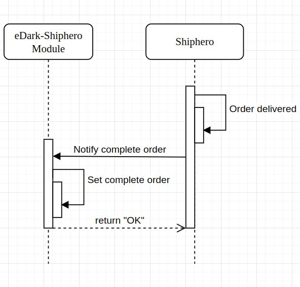

# Shiphero Magento plugin

## Manual Installation 
##### In Magento 2:
1. Add the plugin in the `app/code` directory. If the `code/` folder does not exist, it must be created in the `app/` directory.  
2. In the root directory, run command `php bin/magento module:enable Edarkstore_Shiphero`
3. To check if the plugin is enabled, run the command `php bin/magento module:status`
   
----
## Documentación
### Observers
El módulo utiliza dos observadores para notificar los cambios a nuestro WMS. Los observadores se utilizan para los productos y las órdenes:
##### Products:
Si un producto es modificado o eliminado desde el administrador de la tienda en Magento, nuestro WMS será notificado para actualizar los datos.  
Los observers utilizados son:
- `catalog_product_save_after`
- `catalog_product_delete_after`

##### Orders  
Cuando se confirma un pedido en el sitio o se modifica desde el administrador de Magento, nuestro WMS será notificado de la actualización del pedido o del pedido recién creado.
Los observers utilizados son:
- `admin_sales_order_address_update`
- `sales_model_service_quote_submit_success`

En ambos casos (pedidos y productos) solo se crea una notificación en un sistema de colas, evitando que se vea afectado el rendimiento de la web por una espera en la respuesta de nuestro WMS.

### API
Además de los observadores, el módulo crea 3 endpoints para realizar las actualizaciones de las órdenes. 
##### Invoice (`/V1/shiphero/order/:id/invoice`)
Este endpoint recibe el ID del pedido y genera la factura directamente en Magento una vez confirmado el pago.

##### Shipment (`/V1/shiphero/order/:id/ship`)
Este endpoint recibe el ID del pedido y un JSON con información relacionada (tracking number, shipping method, carrier) y genera un shipment para la orden asociándole el warehouse eDarkstore.

##### Shipment (`/V1/shiphero/order/:id/complete`)
Este endpoint recibe el ID de la orden y marca la orden como completada.
